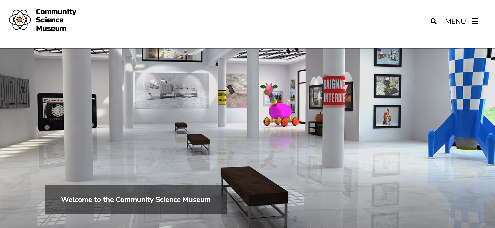
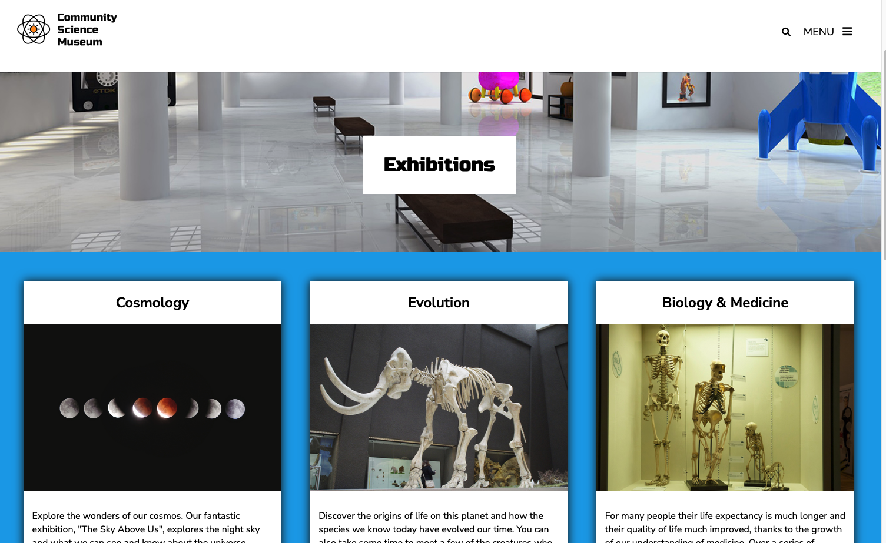

<h1>An interactive website for children´s science museum</h1>

<div id="images">


</div>

 ## Description</h2>
 An interactive website for children´s science museum called Community Science Museum. Site was created for the purpose of semester project. It´s core target audience is primary and middle school children and families with young children. The goal was to create a website that was informative and engaging, but also encouraging for the viewers to visit the museum itself. 
Media assets have been provided.

### Site architecture
- Home
- Exhibitions
- Visit
- Get involved
- Donate


## Built With
- HTML5
- CSS


## Getting Started
Project can be accessed through following repository: 


```
git clone Kinga89/Semester-Project-1
```

---

<div id="social" align="center">
<a href="https://www.linkedin.com/in/kinga-kot-3a4b8a149/">
  
 </a>
  <a href="kotkiga89@gmail.com">
  
 </a>
</div>


<div align="center">
  
</div>
